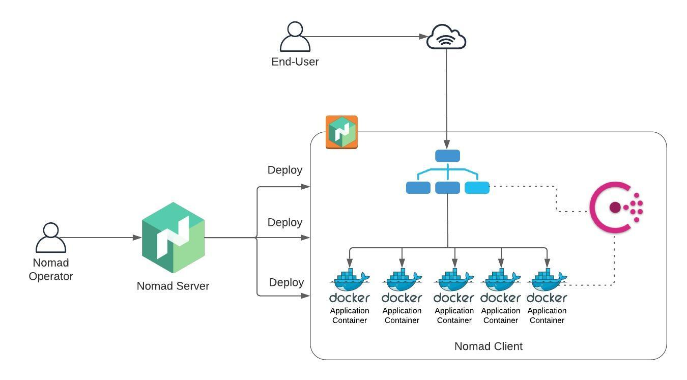
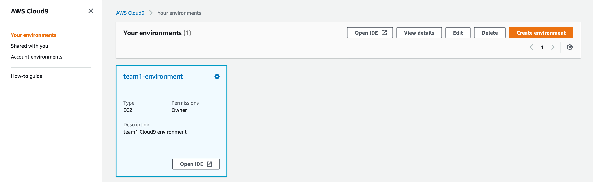
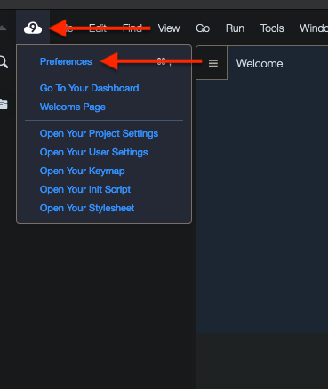
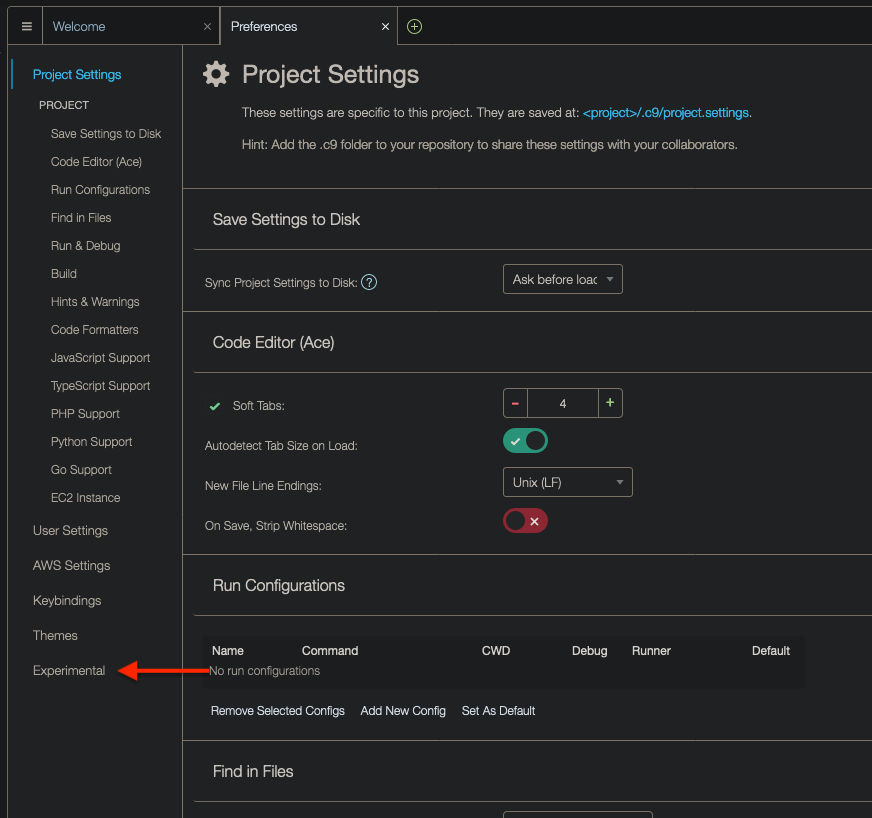
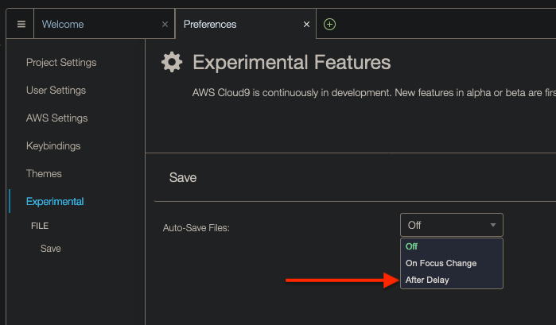
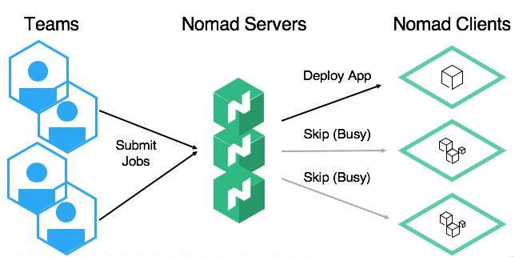
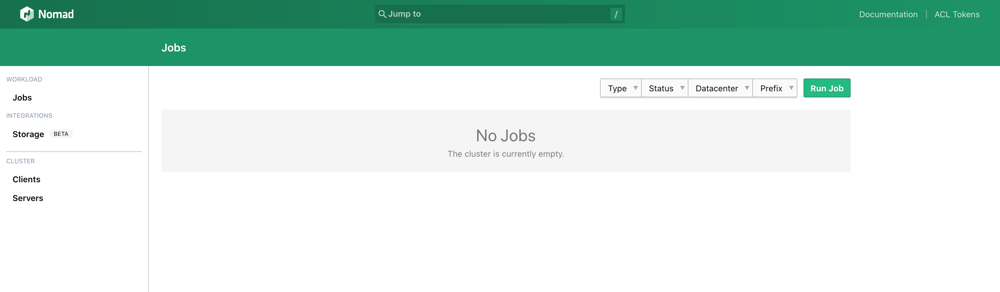
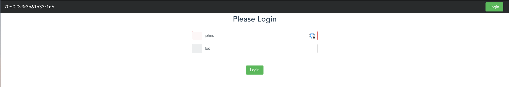
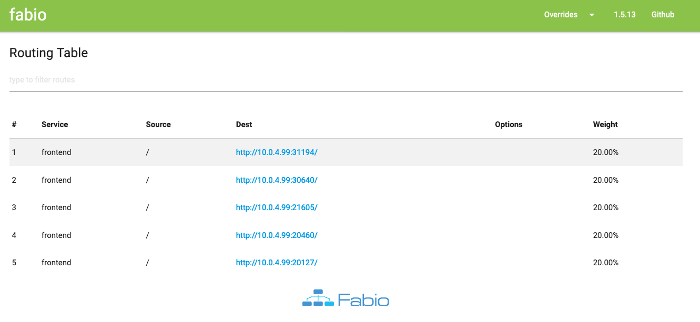
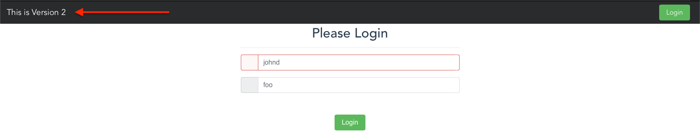

# Table of Contents

- [Introduction](#introduction)
- [How the Challenge is Structured](#how-the-challenge-is-structured)
- [Problem Statemement](#problem-statemement)
- [Architecture](#architecture)
- [Getting Started](#getting-started)
  * [Accessing the AWS Console](#accessing-the-aws-console)
  * [Accessing your Cloud9 Environment](#accessing-your-cloud9-environment)
    + [Enable Auto-Save (optional)](#enable-auto-save-optional)
- [Building the Solution](#building-the-solution)
  * [Installing Nomad (Phase 1)](#installing-nomad-phase-1)
    + [Definition of Done](#definition-of-done)
  * [Starting Nomad in Development Mode (Phase 2)](#starting-nomad-in-development-mode-phase-2)
    + [Definition of Done](#definition-of-done-1)
  * [Deploying your First Job (Phase 3)](#deploying-your-first-job-phase-3)
    + [Planning and Running](#planning-and-running)
    + [For Discussion](#for-discussion)
    + [Definition of Done](#definition-of-done-2)
  * [Creating a Multi-node Cluster (Phase 4)](#creating-a-multi-node-cluster-phase-4)
    + [Starting the server](#starting-the-server)
    + [Starting the Client](#starting-the-client)
    + [Accessing the Nomad UI](#accessing-the-nomad-ui)
    + [Definition of Done](#definition-of-done-3)
  * [Allocating a host port for the front-end container (Phase 5)](#allocating-a-host-port-for-the-front-end-container-phase-5)
    + [For Discussion](#for-discussion-1)
    + [Definition of Done](#definition-of-done-4)
  * [Scaling the Front-end (Phase 6)](#scaling-the-front-end-phase-6)
    + [For Discussion](#for-discussion-2)
    + [Definition of Done](#definition-of-done-5)
  * [Dynamic Ports (Phase 7)](#dynamic-ports-phase-7)
    + [Definition of Done](#definition-of-done-6)
  * [Service Discovery (Phase 8)](#service-discovery-phase-8)
    + [Definition of Done](#definition-of-done-7)
  * [Registering the front-end with Consul (Phase 9)](#registering-the-front-end-with-consul-phase-9)
    + [Definition of Done](#definition-of-done-8)
  * [Running the front-end on the right port (Phase 10)](#running-the-front-end-on-the-right-port-phase-10)
    + [Definition of Done](#definition-of-done-9)
  * [Load Balancer (Phase 11)](#load-balancer-phase-11)
    + [Pro Tip: how to check Fabio's logs](#pro-tip-how-to-check-fabios-logs)
    + [For Discussion](#for-discussion-3)
    + [Definition of Done](#definition-of-done-10)
      - [Front-end](#front-end)
      - [Fabio UI](#fabio-ui)
  * [Canary Deployments (Phase 12)](#canary-deployments-phase-12)
    + [Promoting a Canary](#promoting-a-canary)
    + [Definition of Done](#definition-of-done-11)
- [Conclusion](#conclusion)

# Introduction

In this challenge, you will set up a Nomad cluster and will deploy a front-end application to this cluster which will be served by a Load Balacer. The application should have multiple copies of itself running and the application and Load Balancer should be able to find each other in the cluster.

# How the Challenge is Structured

The challenge will start with an overview of the problem statement and the solution's architecture, followed by a few sections to help you set up your environment. Then, there will be number of sections where each one of them tackles a small piece of the puzzle. And to make sure you've figured out each small piece correctly, there will be **Definition of Done** sections to show you how to test your solution. Finally, you will see some **For discussion** sections (which are optional and can be skipped). The goal of these sections is to create a discussion between the team members and the organizers about a certain topic.

# Problem Statemement

JJR is a multi-national corporation that has recently decided to migrate all their applications to the Cloud and because the Cloud is such a dynamic environment where servers can be easily replaced, they want to use an application scheduler. JJR’s DevOps team has been doing a POC with Kubernetes but they agreed that Kubernetes is unnecessarily complex. After attending HashiConf Digital this year and meeting YOU, a Nomad expert, JJR’s DevOps lead was adamant that Nomad could be the application scheduler they were looking for.

You were hired to build a POC using Nomad that showcases the following:
* Running containerized and non-containerized workloads
* Scaling Application Processes
* Service Discovery
* Application Health Checks
* Load Balancing
* Canary Deployments

# Architecture

This is the architecture diagram of the solution you will be building in this Dojo:



Here's a summary:

* You will configure one EC2 instance to work as the Nomad Server and another EC2 instance to work as the Nomad Client (where the  application will run)
* Consul will be running on the Client to allow services to discover themselves and to monitor their uptime
* There will be 5 copies of the same front-end application running on Docker containers in the Nomad Client
* Fabio (Load Balancer) will use Consul to discover the Docker containers and serve traffic to them
* As an end user, you will be able to reach the front-end application through your Web Browser

# Getting Started

In this section, we'll go through a few steps to make sure you have access to the AWS Console and the code which you will be working on.

## Accessing the AWS Console

To access the AWS Console, head over to the [AWS Sign-In page](https://devops-dojo.signin.aws.amazon.com/console). Your **IAM user name** will be teamX, where X is the number of your team (e.g. team1, team2, team3 etc). The password will be provided to you by one of the organizers.

## Accessing your Cloud9 Environment

> *The steps below should be followed by EVERYONE in the team*

We've set up a [Cloud9 environment](https://aws.amazon.com/cloud9/) for your team. If you haven't heard of Cloud9 yet, it's an AWS solution for teams to write and debug code together just with a web browser (it's basically an IDE which you can access through the AWS Console, everyone sees in real time all the code changes being made and you also have access to a terminal).
After you've logged in to AWS, click on **Services** at the top and type in `Cloud9`. That will take you to the Cloud9 console. You should see your team's environment (team1 has been used as example only):



Click on **Open IDE**. This will be your team's workspace for this Dojo (you don't need to write code in your local computer, but if you want to develop locally and copy and paste to Cloud9, that is totally fine).

### Enable Auto-Save (optional)

To configure Cloud9 to save files automatically, do the following. Click on the Cloud9 icon on the top-left corner and then on Preferences:



At the bottom, click on Experimental:


Finally, click on drop down and then on `After Delay`, which will cause files to be saved after a second or so:


# Building the Solution

## Installing Nomad (Phase 1)

Your Cloud9 environment does not have Nomad. Let's install it first.

Go to the terminal in your Cloud9 environment. Use `wget` to download Nomad. This is the URL: https://releases.hashicorp.com/nomad/0.12.2/nomad_0.12.2_linux_amd64.zip. Once downloaded, unzip it and move the binary to `/usr/bin`.

### Definition of Done

Upon successfully installing Nomad, run the following command and check that output is the same:

```bash
$ nomad version
Nomad v0.12.2 (ee69b3379aeced67e14943b86c4f621451e64e84)
```

## Starting Nomad in Development Mode (Phase 2)

The Nomad architecture consists of servers and clients:



However, Nomad also gives you the option to start it in development mode, meaning that a **single** instance will be the **server AND the client**. Let's run Nomad in dev mode first.

To run Nomad in dev mode is very easy. Type in the following in the terminal:

```bash
sudo nomad agent -dev
```

**PS: if running `sudo nomad` results in `command not found`, [take a look at this Stack Overflow answer](https://askubuntu.com/questions/611528/why-cant-sudo-find-a-command-after-i-added-it-to-path).

Now, to interact with the Nomad server, you will have to open a new terminal tab. Click on the green plus symbol at the top of the Cloud9 terminal and select `New Terminal`.

### Definition of Done

In another terminal tab, run the following command and check if the output says that the node is `ready`.

```bash
$ nomad node status
ID        DC   Name            Class   Drain  Eligibility  Status
XXXXXXX  dc1  ip-XXXXXXXXXXXX  <none>  false  eligible     ready
```

## Deploying your First Job (Phase 3)

To deploy applications to Nomad, you will use the [Hashicorp Configuration Language](https://github.com/hashicorp/hcl) and define [Jobs](https://www.nomadproject.io/docs/job-specification), [Task Groups](https://www.nomadproject.io/docs/job-specification/group) and [Tasks](https://www.nomadproject.io/docs/job-specification/task) - among other things.

The first step will be to define a job. In Cloud9, create a file called `frontend.nomad`. Now, [take a look at this page](https://www.nomadproject.io/docs/job-specification) so you understand how to define a job (if you've worked with Terraform before, you probably already know HCL's syntax). **Please, read the following to define your first job**:

* Give this job a name - I'd suggest naming it `frontend` (that's how this challenge will refer to this job from now on)
* You do not need to define a `region` - you will not deploy clusters in multiple regions in this challenge
* For `datacenters`, check the status of the node (`nomad node status`) and you will see which datacenter the node belongs to (under the `DC` column)
* The `type` should be `service` - A service is a long-lived process that should never go down ([read more here](https://www.nomadproject.io/docs/schedulers))
* Remove `update` - we'll be working on that later

Next, let's work on the `group` stanza. If you're coming from the Kubernetes world, think of `group` as a `pod` (where you can run multiple containers together under the same network stack). Take a look at how you should configure your group:

* The name of the group can be the same as the job - or you can specify something else
* The only configuration you should worry about for now is `count`. `count` defines the number of tasks that will be run by the group. Set it to `1`.

At this point, your `frontend.nomad` should look like the following:

```
job "frontend" {
  datacenters = ["??????"] 
  type = "service"

  group "frontend" {
    count = 1
  }
}
```

Finally, create a [task](https://www.nomadproject.io/docs/job-specification/task) to deploy a **Docker container**. Configure the following parameters only:

* `driver`
* `config.image` - where `image` should be `thedojoseries/frontend`

### Planning and Running

To check if you're able to deploy this job, you can use the command `nomad plan <path-to-job-file>` (which works the same way as `terraform plan`). Run `plan` and you should get the following output:

```
+ Job: "frontend"
+ Task Group: "frontend" (1 create)
  + Task: "frontend" (forces create)

Scheduler dry-run:
- All tasks successfully allocated.

Job Modify Index: 0
To submit the job with version verification run:

nomad job run -check-index 0 frontend/frontend.nomad

When running the job with the check-index flag, the job will only be run if the
job modify index given matches the server-side version. If the index has
changed, another user has modified the job and the plan's results are
potentially invalid.
```

**PS: if you called your job or task group something different than "frontend", then your output will be slightly different**

If you got the output above, you're ready to deploy the job. To deploy, you can run the following command:

```
nomad run <path-to-job-file>
```

### For Discussion

When you planned the job using `nomad plan`, at the bottom of the output you can see a `nomad run` command with a flag: `-check-index`. What is that flag for and why would you need it?

### Definition of Done

When you get the `status` of your job (`nomad status <JOBNAME>`), you should see an allocation at the bottom of the output showing:

```
Allocations
ID        Node ID   Task Group  Version  Desired  Status   Created  Modified
XXXXXXXX  XXXXXXXX  frontend    0        run      running  Xs ago   Xs ago
```

Allocations and Evaluations are two important concepts in Nomad. Later, when you have some time, [read this page to know more](https://www.nomadproject.io/docs/internals/scheduling/scheduling) (**you do not need to know these concepts to complete this challenge**).

## Creating a Multi-node Cluster (Phase 4)

So far, you have been running nomad on a single instance. Now it's time to learn how to create a multi-node cluster where servers and clients are running in separate instances.

Before you do anything, go back to the terminal tab where Nomad is running and press CTRL + C to kill Nomad.

### Starting the server

The instance where your Cloud9 environment is running will be the Nomad server (you will be working with a single server, but for production environments, you'd want to have 3 or 5 **Nomad servers** - plus all the Nomad clients).

Let's customize the configuration for the **Nomad server**. Create a file called `server.hcl` (the name doesn't matter, it can be anything).

There are tons of parameters you can choose from. [Check the documentation](https://www.nomadproject.io/docs/configuration). Let's not get too fancy and use the following parameters only:

* `log_level` - set the log level to DEBUG
* `data_dir` - you could choose any directory, but to make things easier, create a directory under $HOME and specify this directory
* `server.enabled` - Set it to `true`
* `server.bootstrap_expect` - careful with this one. Remember that you will only have a single Nomad server
* `advertise.http` - Set it to `0.0.0.0`. Later you will access the Nomad UI and to be able to do that from outside the cluster, you need to tell Nomad to bind the HTTP server to 0.0.0.0

Here's how your `server.hcl` should look like:

```
# Increase log verbosity
log_level = "DEBUG"

# Setup data dir
data_dir = <DATA_DIR>

# Enable the server
server {
    enabled = <ENABLED>
    bootstrap_expect = <BOOTSTRAP_EXPECT>
}

advertise {
  http = <BIND_ADDRESS>
}
```

Once you're done, start the nomad agent again **without sudo**, and replace the `-dev` flag with another flag that will allow you to provide the path for the configuration file above.

### Starting the Client

As mentioned, the Nomad client will run on a separate instance. The IP of your instance will be `10.0.X.99`, where X is your team number. For example, team1's Nomad client's IP is 10.0.1.99, team2's, 10.0.2.99, and so on.

Open a new tab in your Cloud9 terminal and run the following command:

```
ssh ec2-user@<YOUR-TEAMS-IP-ADDRESS>
```

When you're asked for the password, use the same password you used to log in to AWS.

Once you're in, **install Nomad** (same commands you ran in [Phase 1](#installing-nomad-phase-1)). Then, create a file called `client.hcl`. Here are the parameters that should be configured for the client (note that since you're on another EC2 instance, you can't use Cloud9 directly. But you can code in Cloud9, copy the code and paste it into a file in the client instance):

* `log_level` - set it to DEBUG as well
* `data_dir`
* `name` - This is the name of the client agent. Call it `teamX-client`, where X is the number of your team. For example, team1 would name their client agent `team1-client`.
* `client.enabled` - Set it to `true`
* `client.servers` - The format for this parameter should be `["<SERVER-IP>:4647"]`. To find out the IP address of the Nomad server, run the command `nomad server members` in the Cloud9 terminal. **Please ignore the port you see in the output of the command. The port should be 4647**.

Now, run an agent in the EC2 you SSH'ed into passing `client.hcl` as the config file (**use sudo this time**).

### Accessing the Nomad UI

To access the Nomad UI, you will first need to obtain the Nomad Server's public IP address. From the Nomad Server instance, run the following command: `curl ifconfig.co`. That should return the Nomad Server's public IP address. Grab that IP and access it on port `4646` on your Browser. This is what you should see:



You will not be deploying jobs through the UI in this challenge, but the UI can be very useful whenever you need to debug.

### Definition of Done

From the Nomad server instance, run `nomad node status`. You should see the Nomad client you just configured - `Status` should be `ready`. Alternatively, if you go to the Nomad UI and click on `Clients` on the left, you should see the client listed.

## Allocating a host port for the front-end container (Phase 5)

In the Nomad server, run the frontend job again. Then, switch to the Nomad client (you might need to open yet another terminal tab) and run `docker ps`. You should see the following:

```
CONTAINER ID        IMAGE                    COMMAND               CREATED              STATUS              PORTS               NAMES
56869d1aede6        thedojoseries/frontend   "sh -c 'npm start'"   About a minute ago   Up About a minute   8080/tcp            frontend-afcad319-a9ba-e4a5-0f06-df0f7adf54f8
```

You can see that the container is not exposing any ports to the host, meaning that we can't communicate with the container unless we're inside it. Let's fix that.

Edit `frontend.nomad`. To allocate a static port for the host and map it to the container, use the following snippet:

```
(...)

task "XXXXXX" {
  (...)

  resources {
    network {
      port "http" {
        static = 8080
      }
    }
  }
}

(...)
```

The snippet above will allocate port `8080` in the host and map it to port `8080` in the container. We'll see later why this is not a good idea, but let's go ahead with it for now.

Plan and run the front-end job again.

### For Discussion

The `network` stanza can be defined in 2 different places: under `group` and under `task`. What's the difference?

### Definition of Done

To make sure the right port was allocated, go to the client instance and run `docker ps`. Under the `PORTS` column, you should see the following now:

```
10.0.X.99:8080->8080/tcp, 10.0.X.99:8080->8080/udp
```

If you curl the IP above on port `8080`, you should get back:

```
<!DOCTYPE html>
<html>

<head>
  <meta charset="utf-8">
  <title>frontend</title>
</head>

<body>
  <div class="container">
    <div id="app"></div>
  </div>
<script type="text/javascript" src="/app.js"></script></body>
```

## Scaling the Front-end (Phase 6)

In Nomad, it's possible to horizontally scale an application, meaning that whenever a condition is true, Nomad will start spinning up more copies of the same application across the cluster so that the load is spread more evenly. However, at the time of this writing, [Horizontal Autoscaling is in its early days in Nomad](https://github.com/hashicorp/nomad-autoscaler). Therefore, you won't do any horizontal autoscaling as part of this challenge, but you will learn at least how to run multiple copies of the same application.

Take a look at the [scaling stanza](https://www.nomadproject.io/docs/job-specification/scaling). What you need to do next is to define a scaling stanza in `frontend.nomad` using the information below:

* enabled = `true`
* min = `5`
* max = `10`
* policy = `{}` (A policy will not be provided as it's meant to be used by the [Nomad Autoscaler](https://github.com/hashicorp/nomad-autoscaler))

**PS: if you use the `scaling` stanza, `count` cannot be less than `scaling.min`. Since you added the `scaling` stanza, feel free to remove `count`.**

Plan your changes (**it should fail!**)

### For Discussion

Why did the changes introduced cause `nomad plan` (and, consequently, `nomad run`) to fail?

### Definition of Done

When you ran `nomad plan`, you should've gotten the following output:

```
Scheduler dry-run:
- WARNING: Failed to place all allocations.
  Task Group "frontend" (failed to place 4 allocations):
    * Resources exhausted on 1 nodes
    * Dimension "network: reserved port collision http=8080" exhausted on 1 nodes
```

## Dynamic Ports (Phase 7)

If you haven't figured it out by now, the reason why `nomad plan` failed previously was because you hardcoded port 8080 to be allocated for the host and you asked Nomad to deploy 5 copies of the same application. Naturally, you can't have 5 containers listening on the same port (that's why you got the message `reserved port collision http=8080" exhausted on 1 nodes`). 

Modify the template so that `nomad plan` succeeds - meaning that no ports should be hardcoded. To do that, take a look at the [documentation for the network stanza](https://www.nomadproject.io/docs/job-specification/network).

### Definition of Done

Once you modify the template and run `nomad run`, you should see 5 containers in the Nomad client (each container listening on a different port):

```
$ docker ps
CONTAINER ID        IMAGE                    COMMAND               CREATED             STATUS              PORTS                                                              NAMES
c16c7e13976d        thedojoseries/frontend   "sh -c 'npm start'"   9 seconds ago       Up 7 seconds        8080/tcp, 10.0.4.99:25062->25062/tcp, 10.0.4.99:25062->25062/udp   frontend-81ffb61e-b832-b9e9-813c-70910a698d2c
8dbc935b7839        thedojoseries/frontend   "sh -c 'npm start'"   28 seconds ago      Up 26 seconds       8080/tcp, 10.0.4.99:30117->30117/tcp, 10.0.4.99:30117->30117/udp   frontend-9592dbcf-4d78-9b46-a9bb-2e8aa342b318
4415c3589344        thedojoseries/frontend   "sh -c 'npm start'"   28 seconds ago      Up 26 seconds       8080/tcp, 10.0.4.99:27676->27676/tcp, 10.0.4.99:27676->27676/udp   frontend-19698666-0085-1d03-d6d4-def56fad75ac
f98678e3bed1        thedojoseries/frontend   "sh -c 'npm start'"   28 seconds ago      Up 26 seconds       8080/tcp, 10.0.4.99:25434->25434/tcp, 10.0.4.99:25434->25434/udp   frontend-06734f54-fb5c-b988-3dec-0e695a885525
9f5569ac3dd8        thedojoseries/frontend   "sh -c 'npm start'"   28 seconds ago      Up 26 seconds       8080/tcp, 10.0.4.99:30630->30630/tcp, 10.0.4.99:30630->30630/udp   frontend-e971ae1e-5e53-4d3f-ead0-8843e5e1e70b
```

## Service Discovery (Phase 8)

When two services need to communicate in a Nomad cluster, they need to know where to find each other and that's called **Service Discovery**. Because Nomad is purely a cluster manager and scheduler, you will need another piece of software to help you with service discovery: [Consul](https://www.consul.io/). 

Later in this challenge, you will deploy a Load Balancer that will need to know the whereabouts of the front-end containers, therefore you will deploy Consul in preparation for that.

One of advantages of Nomad over, say, Kubernetes, is that Nomad allows you to run not only [Docker containers](https://www.nomadproject.io/docs/drivers/docker), but [Java applications](https://www.nomadproject.io/docs/drivers/java), [binaries](https://www.nomadproject.io/docs/drivers/exec) and even [virtual machines](https://www.nomadproject.io/docs/drivers/qemu). Instead of running Consul as a container, let's run Consul as a **binary**.

To run a binary you have two options: [exec](https://www.nomadproject.io/docs/drivers/exec) and [raw_exec](https://www.nomadproject.io/docs/drivers/raw_exec). The difference between these two options is that `raw_exec` runs the task as the same user as the Nomad process. If we start Nomad as root, then it'd run tasks as root as well, which is not what you'd want. That's why `raw_exec` should be used with extreme caution and is disabled by default.

To deploy Consul, let's use [exec](https://www.nomadproject.io/docs/drivers/exec) instead. Create a file called `consul.nomad` on the Nomad server. In this file you will need to define a job, a group and task (same thing you did for the front-end). Here's what you need to know to create this job:

* For the purpose of this challenge, you should run Consul in development mode. That can be achieved with the command: `consul agent -dev`
* You only need a single consul process
* You should use Consul version 1.6.2 (You don't need to download the binary yourself. Use the [artifact stanza](https://www.nomadproject.io/docs/job-specification/artifact))

Once you are done with the file, plan and run job.

**PS: To make things clear, you will run `nomad run` on the Nomad server and what Nomad is going to do is to deploy Consul to the Nomad client instance.**

### Definition of Done

To double check Consul has been successfully deployed, go to the Nomad client, run `ps -ef | grep consul` and you should see `consul agent -dev` running. 

## Registering the front-end with Consul (Phase 9)

Now that Consul is running, let's modify the front-end to register itself. Service registry can be achieved with the [service stanza](https://www.nomadproject.io/docs/job-specification/service).

The service stanza has tons of parameters. Here is what you need to configure:

* Give your service a `name`
* Configure the `port`. You do not need to specify the port number. You can simply use the port label you defined (e.g. in `port "http" { }`, `http` is the label)
* Define 2 tags: `frontend` and `urlprefix-/`. You will understand why we need tags later.
* Configure a health check for your service so Consul knows when it's healthy/unhealthy
  * The type of health check should be `http`
  * The path: `/`
  * The frequency of health checks should be every 5 seconds
  * Consul should wait 2 seconds for a response, otherwise the service will be marked as unhealthy

When you're done, run the front-end job again.

### Definition of Done

To make sure the front-end task registered itself with consul, let's use the Consul CLI. The CLI is in theory already in the Nomad client instance, but just to make your life easier, run the following commands in the Nomad client's home directory:

```
$ wget https://releases.hashicorp.com/consul/1.6.2/consul_1.6.2_linux_386.zip
$ unzip consul_1.6.2_linux_386.zip
```

To list the services that have registered with Consul, run the command (inside the home directory where the consul binary is):

```
$ ./consul catalog services -tags
```

You should see the service you defined with the `service` stanza, including the tags. If you can't see your service, try stopping the front-end task using the `nomad stop` command and then run it again with `nomad run`. If you still can't see it, let one of the organizers know.

## Running the front-end on the right port (Phase 10)

You might've noticed that when you run `docker ps`, you will see that Docker allocated random ports to all 5 containers. By the default, the front-end application listens on port 8080, which is a problem because Docker has not opened port 8080 to the host. In other words, there's no way to communicate with the front-end app since it's expecting traffic on port `8080` but the containers have different ports open.

To fix that, you will have to set an **environment variable** for the front-end app called `PORT` (all letters uppercase). The value of of this environment variable is the tricky part.

To find out the value of the environment variable `PORT`, take a look first at the [environment variables available to jobs during runtime](https://www.nomadproject.io/docs/runtime/environment), then check how to do [variable interpolation and how to define environment variables](https://www.nomadproject.io/docs/runtime/interpolation).

Once you changed the job template, run the task again.

### Definition of Done

After a minute or so, go to the Nomad client and run `docker ps`. Look under `PORTS` and you should see something similar to:

```
8080/tcp, 10.0.4.99:24195->24195/tcp, 10.0.4.99:24195->24195/udp
```

The IP and port will likely be different in your case. Grab the container's ID, and run `docker exec -it <CONTAINER_ID> sh`. Once inside the container, run `env | grep PORT`:

```
# env | grep PORT
NOMAD_PORT_http=24195
PORT=24195
NOMAD_HOST_PORT_http=24195
```

In my case, the environment variables `NOMAD_PORT_http` and `PORT` are set to `24195`, meaning that my front-end application is listening on the same port that is being exposed by Docker. 

As a second test, download curl in the container: `apk add --no-cache curl`, then run `curl localhost:8080`. You should've gotten `curl: (7) Failed to connect to localhost port 8080: Connection refused`. Run curl against the port set by the environment variable `NOMAD_PORT_<label>` and you should get:

```
<!DOCTYPE html>
<html>

<head>
  <meta charset="utf-8">
  <title>frontend</title>
</head>

<body>
  <div class="container">
    <div id="app"></div>
  </div>
<script type="text/javascript" src="/app.js"></script></body>
```

## Load Balancer (Phase 11)

At the moment, you have 5 front-end containers running in the cluster and listening on random ports. In a scenario like that, it's impossible to keep track of all containers, their IPs (that constantly change as containers go up and down), and the ports. Therefore, it's time to introduce a Load Balancer into the mix.

There are a few options for Load Balancers:

* [Nginx](https://www.nginx.com/)
* [HAProxy](http://www.haproxy.org/)
* [Traefik](https://containo.us/traefik/)
* [Fabio](https://fabiolb.net/)

For this challenge, we'll be using Fabio. Fabio is an HTTP and TCP reverse proxy that configures itself with data from Consul. And that's why previously you deployed Consul to your Nomad cluster.

I hope you're ready because now you will write a more complex Nomad job template. Here are the requirements:

* Define a job called `fabio`
  * Nomad has 3 types of schedulers: Service, Batch and System. You should configure the job `fabio` to be of type `system`. [Read more about Nomad Schedulers](https://www.nomadproject.io/docs/schedulers)
  * Define a group called `fabio`
    * Define a task called `fabio`
      * Fabio should be run as a Docker container
      * The image for this container should be `fabiolb/fabio`
      * Usually, Docker containers run in a network mode called `Bridge`. In a bridge mode, containers run on a different network stack than the host. Because Fabio needs to be able to communicate easily with Consul, which is running as a process on the host and not as a Docker container, you should configure fabio to run in a network mode called `host` instead (which will run the container in the same network stack as the host). Please note that you **should not** configure the network mode in the `network` stanza. You should configure the Docker driver to use `host` as network mode for the container. [Take a look at this page](https://www.nomadproject.io/docs/drivers/docker).
      * Nomad should allocate 200 MHz of cpu and 128 MB of memory to this task
      * This task should require 20 Megabits of bandwith ([take a look at this page](https://www.nomadproject.io/api-docs/json-jobs))
      * You should allocate two static ports for Fabio:
        * 9999 - Load Balancer
        * 9998 - UI

When you're done, run the job.

### Pro Tip: How to check Fabio's logs

In Nomad, to get logs for a job, you do the following:

```
$ nomad status <JOB_NAME>
```

At the bottom, you should see an Allocations table:

```
Allocations
ID        Node ID   Task Group  Version  Desired  Status  Created    Modified
```

To see the job's logs, grab the latest Allocation ID and run:

```
$ nomad alloc logs <ALLOCATION_ID>
```

If you ran the command above for Fabio, you wouldn't get anything back. That's because, by default, `nomad alloc logs` shows logs that were sent to Standard Output, and because Fabio sends logs to **Standard Error** instead, you will need to specify the flag `-stderr`:

```
$ nomad alloc logs -stderr <ALLOCATION_ID>
```

That should return Fabio's logs for debugging purposes.

### For Discussion

How would Fabio be able to find the front-end and start serving traffic to it?

### Definition of Done

There a couple of things you will need to check.

#### Front-end

First, obtain the public IP address of the **client** using the command: `curl ifconfig.co`. Once you obtained it, access the public IP address of the Nomad client on port `9999`. This is what you should see:



**PS: The front-end is not functional as it needs other services to be up and running, which is out of scope for this challenge. The goal was simply to deploy the front-end.**

#### Fabio UI

To confirm that Fabio is serving traffic to all 5 containers, access the same IP address, but now on port `9998`. This is what you should see:



The IPs and ports will not necessarily be the same as in the image above, but as long as you see all 5 containers listed, you've done everything right!

## Canary Deployments (Phase 12)

Let's take a look at how we can work with Canary deployments in Nomad. You will see that it's quite simple.

In `frontend.nomad`, add an [update stanza](https://www.nomadproject.io/docs/job-specification/update) under `group`. Set the correct parameters based on the information below:

* The maximum number of allocations within a task group that can be updated at a time should be `1`
* The new allocations should be healthy within 5 to 30 seconds
* A failed allocation should not be auto-reverted to the previous version
* A successful allocation should not be auto-promoted
* There should be only 1 canary during a deployment

After configuring canary deployments, let's change the Docker image tag. Find the `config` stanza in the task, and change the docker image from `thedojoseries/frontend` to `thedojoseries/frontend:2.0`.

Run these changes.

If you go to the Nomad client, you will see that a new container was span up and it's using the new image:

```
CONTAINER ID        IMAGE                        COMMAND                  CREATED             STATUS              PORTS                                                              NAMES
ac158e5d4710        thedojoseries/frontend:2.0   "docker-entrypoint.s…"   48 seconds ago      Up 46 seconds       8080/tcp, 10.0.4.99:26952->26952/tcp, 10.0.4.99:26952->26952/udp   frontend-6c33182a-f1c3-d8ea-60ea-3fc8eab7e96c
cfaa28c5040e        thedojoseries/frontend       "sh -c 'npm start'"      23 minutes ago      Up 23 minutes       8080/tcp, 10.0.4.99:26067->26067/tcp, 10.0.4.99:26067->26067/udp   frontend-24f5494c-6062-18a2-9b50-c8a789be38ac
ee69ef301d3d        thedojoseries/frontend       "sh -c 'npm start'"      23 minutes ago      Up 23 minutes       8080/tcp, 10.0.4.99:21894->21894/tcp, 10.0.4.99:21894->21894/udp   frontend-84eb80bd-0dc1-442f-1162-60915223e6ba
d34ef578dba8        thedojoseries/frontend       "sh -c 'npm start'"      23 minutes ago      Up 23 minutes       8080/tcp, 10.0.4.99:29794->29794/tcp, 10.0.4.99:29794->29794/udp   frontend-a6d1bcf2-4dd4-6718-87c2-bceac43a8e80
d706ee9439ac        thedojoseries/frontend       "sh -c 'npm start'"      23 minutes ago      Up 23 minutes       8080/tcp, 10.0.4.99:20520->20520/tcp, 10.0.4.99:20520->20520/udp   frontend-cb2275f9-b321-e37d-e7e2-2016f7235936
5cb4f4a86170        thedojoseries/frontend       "sh -c 'npm start'"      23 minutes ago      Up 23 minutes       8080/tcp, 10.0.4.99:25210->25210/tcp, 10.0.4.99:25210->25210/udp   frontend-bd2e7f6e-b89a-45d7-7475-d344788af87b
28b1a95a9e03        fabiolb/fabio                "/usr/bin/fabio -cfg…"   26 minutes ago      Up 26 minutes                                                                          fabio-e4542504-2322-fc38-13bd-bfe22e48b671
```

Go to your web browser and access the frontend (`<NOMAD_CLIENT_PUBLIC_IP>:9999`). After a few refreshes, you should see the new version:



**PS: During testing, I noticed that in some Browsers whenever 2.0 is loaded, the Browser refreshes the website and loads the older version back. Don't worry too much about it. As long as you see version 2.0 loading, even if it's for a fraction of a second, move on.**

### Promoting a Canary

Once you verified that the new version is running fine, run `nomad job promote <JOBNAME>` to replace the old allocations with new allocations using the new Docker image.

### Definition of Done

After a minute or so, you should have 5 containers using the new image:

```
CONTAINER ID        IMAGE                        COMMAND                  CREATED              STATUS              PORTS                                                              NAMES
9baf17ec6c5d        thedojoseries/frontend:2.0   "docker-entrypoint.s…"   13 seconds ago       Up 12 seconds       8080/tcp, 10.0.4.99:29732->29732/tcp, 10.0.4.99:29732->29732/udp   frontend-8b35ac56-4996-9d4f-4a72-39873b5e93c6
fbbb2ed7b318        thedojoseries/frontend:2.0   "docker-entrypoint.s…"   35 seconds ago       Up 34 seconds       8080/tcp, 10.0.4.99:23220->23220/tcp, 10.0.4.99:23220->23220/udp   frontend-c7721ae0-0d3c-9415-8e6a-61b8e371eb29
5d8232fde665        thedojoseries/frontend:2.0   "docker-entrypoint.s…"   59 seconds ago       Up 58 seconds       8080/tcp, 10.0.4.99:20162->20162/tcp, 10.0.4.99:20162->20162/udp   frontend-8b78f506-4e12-fb3e-b407-d94d634a114a
119bb1f456c1        thedojoseries/frontend:2.0   "docker-entrypoint.s…"   About a minute ago   Up About a minute   8080/tcp, 10.0.4.99:27060->27060/tcp, 10.0.4.99:27060->27060/udp   frontend-f7a5e508-63a4-c326-2d2d-c0aa336c708a
ac158e5d4710        thedojoseries/frontend:2.0   "docker-entrypoint.s…"   12 minutes ago       Up 12 minutes       8080/tcp, 10.0.4.99:26952->26952/tcp, 10.0.4.99:26952->26952/udp   frontend-6c33182a-f1c3-d8ea-60ea-3fc8eab7e96c
28b1a95a9e03        fabiolb/fabio                "/usr/bin/fabio -cfg…"   38 minutes ago       Up 38 minutes                                                                          fabio-e4542504-2322-fc38-13bd-bfe22e48b671
```

Now, if you reload your web browser a least 6 times, you should only get the website with `This is Version 2` at the top.

# Conclusion

Congratulations on finishing the challenge! Here's a recap of what you learned:

* Set up Nomad clusters using a single and multiple instances
* Deploy applications to Nomad using different drivers (not only Docker)
* Run Consul for service discovery and application monitoring
* Use a fast, modern, no-config HTTP(S) and TCP load balancer to scale Consul-managed applications
* Perform Canary deployments to slowly roll out new features

I hope you had fun doing this challenge. See you in the next DevOps Dojo!

